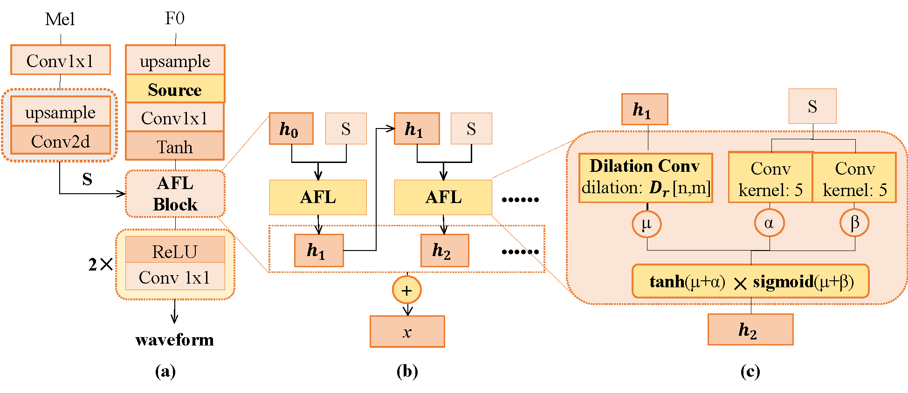
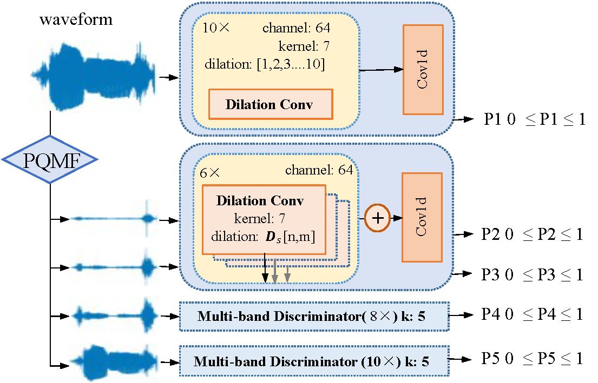

{:.no_toc}
* toc
{:toc}

# Abstract
{: width="75%"}{: .center}  
{: width="85%"}{: .center}  

  Deep generative models have achieved significant progress in speech synthesis to date, while high-fidelity singing voice synthesis is still an open problem for its long continuous pronunciation, rich high-frequency parts, and strong expressiveness. Existing neural vocoders designed for text-to-speech cannot directly be applied to singing voice synthesis because they result in glitches and poor high-frequency reconstruction. In this work, we propose SingGAN, a generative adversarial network designed for high-fidelity singing voice synthesis. Specifically, 1) to alleviate the glitch problem in the generated samples, we propose source excitation with the adaptive feature learning filters to expand the receptive field patterns and stabilize long continuous signal generation; and 2) SingGAN introduces global and local discriminators at different scales to enrich low-frequency details and promote high-frequency reconstruction; and 3) To improve the training efficiency, SingGAN includes auxiliary spectrogram losses and sub-band feature matching penalty loss. To the best of our knowledge, SingGAN is the first work designed toward high-fidelity singing voice vocoding. Our evaluation of SingGAN demonstrates the state-of-the-art results with higher-quality (MOS 4.05) samples. Also, SingGAN enables a sample speed of 50x faster than real-time on a single NVIDIA 2080Ti GPU. We further show that SingGAN generalizes well to the mel-spectrogram inversion of unseen singers, and the end-to-end singing voice synthesis system SingGAN-SVS enjoys a two-stage pipeline to transform the music scores into expressive singing voices. 
Audio samples are available at  <a href="https://SingGAN.github.io/">https://SingGAN.github.io</a>, and we will release our code and pre-trained model in the future.

# Seen Singers

## Woman

<table>
    <thead>
    <th style="text-align: center">Item</th>
    <th style="text-align: center">GT</th>
    <th style="text-align: center">WaveRNN</th>
    <th style="text-align: center">NSF</th>
    <th style="text-align: center">MelGAN</th>
    <th style="text-align: center">Parallel WaveGAN</th>
    <th style="text-align: center">HIFIGAN</th>
    <th style="text-align: center">DiffWave</th>
    <th style="text-align: center">SingGAN</th>
    </thead>
    <tbody>
        <tr>
            <th>#1</th>
            <td style="text-align: center"><audio controls style="width: 150px;"><source src="wav_for_demo/seen-singing/gt/f002-5.wav" type="audio/wav"></audio></td>
            <td style="text-align: center"><audio controls style="width: 150px;"><source src="wav_for_demo/seen-singing/waveRNN_n/f002-5.wav" type="audio/wav"></audio></td>
            <td style="text-align: center"><audio controls style="width: 150px;"><source src="wav_for_demo/seen-singing/nsf/f002-5_gen.wav" type="audio/wav"></audio></td>
            <td style="text-align: center"><audio controls style="width: 150px;"><source src="wav_for_demo/seen-singing/FBMelGAN/f002-5.wav" type="audio/wav"></audio></td>
            <td style="text-align: center"><audio controls style="width: 150px;"><source src="wav_for_demo/seen-singing/pwg/f002-5_gen.wav" type="audio/wav"></audio></td>
             <td style="text-align: center"><audio controls style="width: 150px;"><source src="wav_for_demo/seen-singing/diffwave/f002-5_6.wav" type="audio/wav"></audio></td>
            <td style="text-align: center"><audio controls style="width: 150px;"><source src="wav_for_demo/seen-singing/HIFIGAN/f002-5_generated.wav" type="audio/wav"></audio></td>           
            <td style="text-align: center"><audio controls style="width: 150px;"><source src="wav_for_demo/seen-singing/SingVocoder/f002-5_gen.wav" type="audio/wav"></audio></td>
        </tr>
    </tbody>
    <tbody>
        <tr>
            <th>#2</th>
            <td style="text-align: center"><audio controls style="width: 150px;"><source src="wav_for_demo/seen-singing/gt/f005-2.wav" type="audio/wav"></audio></td>
            <td style="text-align: center"><audio controls style="width: 150px;"><source src="wav_for_demo/seen-singing/waveRNN_n/f005-2.wav" type="audio/wav"></audio></td>
            <td style="text-align: center"><audio controls style="width: 150px;"><source src="wav_for_demo/seen-singing/nsf/f005-2_gen.wav" type="audio/wav"></audio></td>
            <td style="text-align: center"><audio controls style="width: 150px;"><source src="wav_for_demo/seen-singing/FBMelGAN/f005-2.wav" type="audio/wav"></audio></td>
            <td style="text-align: center"><audio controls style="width: 150px;"><source src="wav_for_demo/seen-singing/pwg/f005-2_gen.wav" type="audio/wav"></audio></td>
             <td style="text-align: center"><audio controls style="width: 150px;"><source src="wav_for_demo/seen-singing/diffwave/f005-2_6.wav" type="audio/wav"></audio></td>
            <td style="text-align: center"><audio controls style="width: 150px;"><source src="wav_for_demo/seen-singing/HIFIGAN/f005-2_generated.wav" type="audio/wav"></audio></td>           
            <td style="text-align: center"><audio controls style="width: 150px;"><source src="wav_for_demo/seen-singing/SingVocoder/f005-2_gen.wav" type="audio/wav"></audio></td>
        </tr>
    </tbody>
    <tbody>
        <tr>
            <th>#3</th>
            <td style="text-align: center"><audio controls style="width: 150px;"><source src="wav_for_demo/seen-singing/gt/f002-6.wav" type="audio/wav"></audio></td>
            <td style="text-align: center"><audio controls style="width: 150px;"><source src="wav_for_demo/seen-singing/waveRNN_n/f002-6.wav" type="audio/wav"></audio></td>
            <td style="text-align: center"><audio controls style="width: 150px;"><source src="wav_for_demo/seen-singing/nsf/f002-6_gen.wav" type="audio/wav"></audio></td>
            <td style="text-align: center"><audio controls style="width: 150px;"><source src="wav_for_demo/seen-singing/FBMelGAN/f002-6.wav" type="audio/wav"></audio></td>
            <td style="text-align: center"><audio controls style="width: 150px;"><source src="wav_for_demo/seen-singing/pwg/f002-6_gen.wav" type="audio/wav"></audio></td>
             <td style="text-align: center"><audio controls style="width: 150px;"><source src="wav_for_demo/seen-singing/diffwave/f002-6_6.wav" type="audio/wav"></audio></td>
            <td style="text-align: center"><audio controls style="width: 150px;"><source src="wav_for_demo/seen-singing/HIFIGAN/f002-6_generated.wav" type="audio/wav"></audio></td>           
            <td style="text-align: center"><audio controls style="width: 150px;"><source src="wav_for_demo/seen-singing/SingVocoder/f002-6_gen.wav" type="audio/wav"></audio></td>
        </tr>
    </tbody>
    <tbody>
        <tr>
            <th>#4</th>
            <td style="text-align: center"><audio controls style="width: 150px;"><source src="wav_for_demo/seen-singing/gt/f002-2.wav" type="audio/wav"></audio></td>
            <td style="text-align: center"><audio controls style="width: 150px;"><source src="wav_for_demo/seen-singing/waveRNN_n/f002-2.wav" type="audio/wav"></audio></td>
            <td style="text-align: center"><audio controls style="width: 150px;"><source src="wav_for_demo/seen-singing/nsf/f002-2_gen.wav" type="audio/wav"></audio></td>
            <td style="text-align: center"><audio controls style="width: 150px;"><source src="wav_for_demo/seen-singing/FBMelGAN/f002-2.wav" type="audio/wav"></audio></td>
            <td style="text-align: center"><audio controls style="width: 150px;"><source src="wav_for_demo/seen-singing/pwg/f002-2_gen.wav" type="audio/wav"></audio></td>
             <td style="text-align: center"><audio controls style="width: 150px;"><source src="wav_for_demo/seen-singing/diffwave/f002-2_6.wav" type="audio/wav"></audio></td>
            <td style="text-align: center"><audio controls style="width: 150px;"><source src="wav_for_demo/seen-singing/HIFIGAN/f002-2_generated.wav" type="audio/wav"></audio></td>           
            <td style="text-align: center"><audio controls style="width: 150px;"><source src="wav_for_demo/seen-singing/SingVocoder/f002-2_gen.wav" type="audio/wav"></audio></td>
        </tr>
    </tbody>
    <tbody>
        <tr>
            <th>#5</th>
            <td style="text-align: center"><audio controls style="width: 150px;"><source src="wav_for_demo/seen-singing/gt/f005-6.wav" type="audio/wav"></audio></td>
            <td style="text-align: center"><audio controls style="width: 150px;"><source src="wav_for_demo/seen-singing/waveRNN_n/f005-6.wav" type="audio/wav"></audio></td>
            <td style="text-align: center"><audio controls style="width: 150px;"><source src="wav_for_demo/seen-singing/nsf/f005-6_gen.wav" type="audio/wav"></audio></td>
            <td style="text-align: center"><audio controls style="width: 150px;"><source src="wav_for_demo/seen-singing/FBMelGAN/f005-6.wav" type="audio/wav"></audio></td>
            <td style="text-align: center"><audio controls style="width: 150px;"><source src="wav_for_demo/seen-singing/pwg/f005-6_gen.wav" type="audio/wav"></audio></td>
             <td style="text-align: center"><audio controls style="width: 150px;"><source src="wav_for_demo/seen-singing/diffwave/f005-6_6.wav" type="audio/wav"></audio></td>
            <td style="text-align: center"><audio controls style="width: 150px;"><source src="wav_for_demo/seen-singing/HIFIGAN/f005-6_generated.wav" type="audio/wav"></audio></td>           
            <td style="text-align: center"><audio controls style="width: 150px;"><source src="wav_for_demo/seen-singing/SingVocoder/f005-6_gen.wav" type="audio/wav"></audio></td>
        </tr>
    </tbody>
</table>

## Man

<table>
    <thead>
    <th style="text-align: center">Item</th>
    <th style="text-align: center">GT</th>
    <th style="text-align: center">WaveRNN</th>
    <th style="text-align: center">NSF</th>
    <th style="text-align: center">MelGAN</th>
    <th style="text-align: center">Parallel WaveGAN</th>
    <th style="text-align: center">HIFIGAN</th>
    <th style="text-align: center">DiffWave</th>
    <th style="text-align: center">SingGAN</th>
    </thead>
    <tbody>
        <tr>
            <th>#1</th>
            <td style="text-align: center"><audio controls style="width: 150px;"><source src="wav_for_demo/seen-singing/gt/004-10.wav" type="audio/wav"></audio></td>
            <td style="text-align: center"><audio controls style="width: 150px;"><source src="wav_for_demo/seen-singing/waveRNN_n/004-10.wav" type="audio/wav"></audio></td>
            <td style="text-align: center"><audio controls style="width: 150px;"><source src="wav_for_demo/seen-singing/nsf/004-10_gen.wav" type="audio/wav"></audio></td>
            <td style="text-align: center"><audio controls style="width: 150px;"><source src="wav_for_demo/seen-singing/FBMelGAN/004-10.wav" type="audio/wav"></audio></td>
            <td style="text-align: center"><audio controls style="width: 150px;"><source src="wav_for_demo/seen-singing/pwg/004-10_gen.wav" type="audio/wav"></audio></td>
             <td style="text-align: center"><audio controls style="width: 150px;"><source src="wav_for_demo/seen-singing/diffwave/004-10_6.wav" type="audio/wav"></audio></td>
            <td style="text-align: center"><audio controls style="width: 150px;"><source src="wav_for_demo/seen-singing/HIFIGAN/004-10_generated.wav" type="audio/wav"></audio></td>           
            <td style="text-align: center"><audio controls style="width: 150px;"><source src="wav_for_demo/seen-singing/SingVocoder/004-10_gen.wav" type="audio/wav"></audio></td>
        </tr>
    </tbody>
    <tbody>
        <tr>
            <th>#2</th>
            <td style="text-align: center"><audio controls style="width: 150px;"><source src="wav_for_demo/seen-singing/gt/004-9.wav" type="audio/wav"></audio></td>
            <td style="text-align: center"><audio controls style="width: 150px;"><source src="wav_for_demo/seen-singing/waveRNN_n/004-9.wav" type="audio/wav"></audio></td>
            <td style="text-align: center"><audio controls style="width: 150px;"><source src="wav_for_demo/seen-singing/nsf/004-9_gen.wav" type="audio/wav"></audio></td>
            <td style="text-align: center"><audio controls style="width: 150px;"><source src="wav_for_demo/seen-singing/FBMelGAN/004-9.wav" type="audio/wav"></audio></td>
            <td style="text-align: center"><audio controls style="width: 150px;"><source src="wav_for_demo/seen-singing/pwg/004-9_gen.wav" type="audio/wav"></audio></td>
             <td style="text-align: center"><audio controls style="width: 150px;"><source src="wav_for_demo/seen-singing/diffwave/004-9_6.wav" type="audio/wav"></audio></td>
            <td style="text-align: center"><audio controls style="width: 150px;"><source src="wav_for_demo/seen-singing/HIFIGAN/004-9_generated.wav" type="audio/wav"></audio></td>           
            <td style="text-align: center"><audio controls style="width: 150px;"><source src="wav_for_demo/seen-singing/SingVocoder/004-9_gen.wav" type="audio/wav"></audio></td>
        </tr>
    </tbody>
    <tbody>
        <tr>
            <th>#3</th>
            <td style="text-align: center"><audio controls style="width: 150px;"><source src="wav_for_demo/seen-singing/gt/005-9.wav" type="audio/wav"></audio></td>
            <td style="text-align: center"><audio controls style="width: 150px;"><source src="wav_for_demo/seen-singing/waveRNN_n/005-9.wav" type="audio/wav"></audio></td>
            <td style="text-align: center"><audio controls style="width: 150px;"><source src="wav_for_demo/seen-singing/nsf/005-9_gen.wav" type="audio/wav"></audio></td>
            <td style="text-align: center"><audio controls style="width: 150px;"><source src="wav_for_demo/seen-singing/FBMelGAN/005-9.wav" type="audio/wav"></audio></td>
            <td style="text-align: center"><audio controls style="width: 150px;"><source src="wav_for_demo/seen-singing/pwg/005-9_gen.wav" type="audio/wav"></audio></td>
             <td style="text-align: center"><audio controls style="width: 150px;"><source src="wav_for_demo/seen-singing/diffwave/005-9_6.wav" type="audio/wav"></audio></td>
            <td style="text-align: center"><audio controls style="width: 150px;"><source src="wav_for_demo/seen-singing/HIFIGAN/005-9_generated.wav" type="audio/wav"></audio></td>           
            <td style="text-align: center"><audio controls style="width: 150px;"><source src="wav_for_demo/seen-singing/SingVocoder/005-9_gen.wav" type="audio/wav"></audio></td>
        </tr>
    </tbody>
    <tbody>
        <tr>
            <th>#4</th>
            <td style="text-align: center"><audio controls style="width: 150px;"><source src="wav_for_demo/seen-singing/gt/005-1.wav" type="audio/wav"></audio></td>
            <td style="text-align: center"><audio controls style="width: 150px;"><source src="wav_for_demo/seen-singing/waveRNN_n/005-1.wav" type="audio/wav"></audio></td>
            <td style="text-align: center"><audio controls style="width: 150px;"><source src="wav_for_demo/seen-singing/nsf/005-1_gen.wav" type="audio/wav"></audio></td>
            <td style="text-align: center"><audio controls style="width: 150px;"><source src="wav_for_demo/seen-singing/FBMelGAN/005-1.wav" type="audio/wav"></audio></td>
            <td style="text-align: center"><audio controls style="width: 150px;"><source src="wav_for_demo/seen-singing/pwg/005-1_gen.wav" type="audio/wav"></audio></td>
             <td style="text-align: center"><audio controls style="width: 150px;"><source src="wav_for_demo/seen-singing/diffwave/005-1_6.wav" type="audio/wav"></audio></td>
            <td style="text-align: center"><audio controls style="width: 150px;"><source src="wav_for_demo/seen-singing/HIFIGAN/005-1_generated.wav" type="audio/wav"></audio></td>           
            <td style="text-align: center"><audio controls style="width: 150px;"><source src="wav_for_demo/seen-singing/SingVocoder/005-1_gen.wav" type="audio/wav"></audio></td>
        </tr>
    </tbody>
    <tbody>
        <tr>
            <th>#5</th>
            <td style="text-align: center"><audio controls style="width: 150px;"><source src="wav_for_demo/seen-singing/gt/004-7.wav" type="audio/wav"></audio></td>
            <td style="text-align: center"><audio controls style="width: 150px;"><source src="wav_for_demo/seen-singing/waveRNN_n/004-7.wav" type="audio/wav"></audio></td>
            <td style="text-align: center"><audio controls style="width: 150px;"><source src="wav_for_demo/seen-singing/nsf/004-7_gen.wav" type="audio/wav"></audio></td>
            <td style="text-align: center"><audio controls style="width: 150px;"><source src="wav_for_demo/seen-singing/FBMelGAN/004-7.wav" type="audio/wav"></audio></td>
            <td style="text-align: center"><audio controls style="width: 150px;"><source src="wav_for_demo/seen-singing/pwg/004-7_gen.wav" type="audio/wav"></audio></td>
             <td style="text-align: center"><audio controls style="width: 150px;"><source src="wav_for_demo/seen-singing/diffwave/004-7_6.wav" type="audio/wav"></audio></td>
            <td style="text-align: center"><audio controls style="width: 150px;"><source src="wav_for_demo/seen-singing/HIFIGAN/004-7_generated.wav" type="audio/wav"></audio></td>           
            <td style="text-align: center"><audio controls style="width: 150px;"><source src="wav_for_demo/seen-singing/SingVocoder/004-7_gen.wav" type="audio/wav"></audio></td>
        </tr>
    </tbody>
</table>

#  Unseen Singers

## Woman
<table>
    <thead>
    <th style="text-align: center">Item</th>
    <th style="text-align: center">GT</th>
    <th style="text-align: center">WaveRNN</th>
    <th style="text-align: center">NSF</th>
    <th style="text-align: center">MelGAN</th>
    <th style="text-align: center">Parallel WaveGAN</th>
    <th style="text-align: center">HIFIGAN</th>
    <th style="text-align: center">DiffWave</th>
    <th style="text-align: center">SingGAN</th>
    </thead>
    <tbody>
        <tr>
            <th>#1</th>
            <td style="text-align: center"><audio controls style="width: 150px;"><source src="wav_for_demo/unseen-singing/gt/women/F3_1_02.wav" type="audio/wav"></audio></td>
            <td style="text-align: center"><audio controls style="width: 150px;"><source src="wav_for_demo/unseen-singing/waveRNN/women/F3_1_02.wav" type="audio/wav"></audio></td>
            <td style="text-align: center"><audio controls style="width: 150px;"><source src="wav_for_demo/unseen-singing/nsf/women/F3_1_02_gen.wav" type="audio/wav"></audio></td>
            <td style="text-align: center"><audio controls style="width: 150px;"><source src="wav_for_demo/unseen-singing/FBMelGAN/women/F3_1_02.wav" type="audio/wav"></audio></td>
            <td style="text-align: center"><audio controls style="width: 150px;"><source src="wav_for_demo/unseen-singing/pwg_all/women/F3_1_02_gen.wav" type="audio/wav"></audio></td>
             <td style="text-align: center"><audio controls style="width: 150px;"><source src="wav_for_demo/unseen-singing/Diffwave/unseen_woman/F3_1_02.wav" type="audio/wav"></audio></td>
            <td style="text-align: center"><audio controls style="width: 150px;"><source src="wav_for_demo/unseen-singing/HIFIGAN/unseen_woman/F3_1_02_generated.wav" type="audio/wav"></audio></td>           
            <td style="text-align: center"><audio controls style="width: 150px;"><source src="wav_for_demo/unseen-singing/SingVocoder/women/F3_1_02_gen.wav" type="audio/wav"></audio></td>
        </tr>
    </tbody>
    <tbody>
        <tr>
            <th>#2</th>
            <td style="text-align: center"><audio controls style="width: 150px;"><source src="wav_for_demo/unseen-singing/gt/women/F1_1_03.wav" type="audio/wav"></audio></td>
            <td style="text-align: center"><audio controls style="width: 150px;"><source src="wav_for_demo/unseen-singing/waveRNN/women/F1_1_03.wav" type="audio/wav"></audio></td>
            <td style="text-align: center"><audio controls style="width: 150px;"><source src="wav_for_demo/unseen-singing/nsf/women/F1_1_03_gen.wav" type="audio/wav"></audio></td>
            <td style="text-align: center"><audio controls style="width: 150px;"><source src="wav_for_demo/unseen-singing/FBMelGAN/women/F1_1_03.wav" type="audio/wav"></audio></td>
            <td style="text-align: center"><audio controls style="width: 150px;"><source src="wav_for_demo/unseen-singing/pwg_all/women/F1_1_03_gen.wav" type="audio/wav"></audio></td>
             <td style="text-align: center"><audio controls style="width: 150px;"><source src="wav_for_demo/unseen-singing/Diffwave/unseen_woman/F1_1_03.wav" type="audio/wav"></audio></td>
            <td style="text-align: center"><audio controls style="width: 150px;"><source src="wav_for_demo/unseen-singing/HIFIGAN/unseen_woman/F1_1_03_generated.wav" type="audio/wav"></audio></td>           
            <td style="text-align: center"><audio controls style="width: 150px;"><source src="wav_for_demo/unseen-singing/SingVocoder/women/F1_1_03_gen.wav" type="audio/wav"></audio></td>
        </tr>
    </tbody>
        <tbody>
        <tr>
            <th>#3</th>
            <td style="text-align: center"><audio controls style="width: 150px;"><source src="wav_for_demo/unseen-singing/gt/women/F4_2_01.wav" type="audio/wav"></audio></td>
            <td style="text-align: center"><audio controls style="width: 150px;"><source src="wav_for_demo/unseen-singing/waveRNN/women/F4_2_01.wav" type="audio/wav"></audio></td>
            <td style="text-align: center"><audio controls style="width: 150px;"><source src="wav_for_demo/unseen-singing/nsf/women/F4_2_01_gen.wav" type="audio/wav"></audio></td>
            <td style="text-align: center"><audio controls style="width: 150px;"><source src="wav_for_demo/unseen-singing/FBMelGAN/women/F4_2_01.wav" type="audio/wav"></audio></td>
            <td style="text-align: center"><audio controls style="width: 150px;"><source src="wav_for_demo/unseen-singing/pwg_all/women/F4_2_01_gen.wav" type="audio/wav"></audio></td>
             <td style="text-align: center"><audio controls style="width: 150px;"><source src="wav_for_demo/unseen-singing/Diffwave/unseen_woman/F4_2_01.wav" type="audio/wav"></audio></td>
            <td style="text-align: center"><audio controls style="width: 150px;"><source src="wav_for_demo/unseen-singing/HIFIGAN/unseen_woman/F4_2_01_generated.wav" type="audio/wav"></audio></td>           
            <td style="text-align: center"><audio controls style="width: 150px;"><source src="wav_for_demo/unseen-singing/SingVocoder/women/F4_2_01_gen.wav" type="audio/wav"></audio></td>
        </tr>
    </tbody>
    <tbody>
        <tr>
            <th>#4</th>
            <td style="text-align: center"><audio controls style="width: 150px;"><source src="wav_for_demo/unseen-singing/gt/women/vocal-盛夏的果实_06.wav" type="audio/wav"></audio></td>
            <td style="text-align: center"><audio controls style="width: 150px;"><source src="wav_for_demo/unseen-singing/waveRNN/women/vocal-盛夏的果实_06.wav" type="audio/wav"></audio></td>
            <td style="text-align: center"><audio controls style="width: 150px;"><source src="wav_for_demo/unseen-singing/nsf/women/vocal-盛夏的果实_06_gen.wav" type="audio/wav"></audio></td>
            <td style="text-align: center"><audio controls style="width: 150px;"><source src="wav_for_demo/unseen-singing/FBMelGAN/women/vocal-盛夏的果实_06.wav" type="audio/wav"></audio></td>
            <td style="text-align: center"><audio controls style="width: 150px;"><source src="wav_for_demo/unseen-singing/pwg_all/women/vocal-盛夏的果实_06_gen.wav" type="audio/wav"></audio></td>
             <td style="text-align: center"><audio controls style="width: 150px;"><source src="wav_for_demo/unseen-singing/Diffwave/unseen_woman/vocal-盛夏的果实_06.wav" type="audio/wav"></audio></td>
            <td style="text-align: center"><audio controls style="width: 150px;"><source src="wav_for_demo/unseen-singing/HIFIGAN/unseen_woman/vocal-盛夏的果实_06_generated.wav" type="audio/wav"></audio></td>           
            <td style="text-align: center"><audio controls style="width: 150px;"><source src="wav_for_demo/unseen-singing/SingVocoder/women/vocal-盛夏的果实_06_gen.wav" type="audio/wav"></audio></td>
        </tr>
    </tbody>
    <tbody>
        <tr>
            <th>#5</th>
            <td style="text-align: center"><audio controls style="width: 150px;"><source src="wav_for_demo/unseen-singing/gt/women/中文女声DM-001-22.wav" type="audio/wav"></audio></td>
            <td style="text-align: center"><audio controls style="width: 150px;"><source src="wav_for_demo/unseen-singing/waveRNN/women/中文女声DM-001-22.wav" type="audio/wav"></audio></td>
            <td style="text-align: center"><audio controls style="width: 150px;"><source src="wav_for_demo/unseen-singing/nsf/women/中文女声DM-001-22_gen.wav" type="audio/wav"></audio></td>
            <td style="text-align: center"><audio controls style="width: 150px;"><source src="wav_for_demo/unseen-singing/FBMelGAN/women/中文女声DM-001-22.wav" type="audio/wav"></audio></td>
            <td style="text-align: center"><audio controls style="width: 150px;"><source src="wav_for_demo/unseen-singing/pwg_all/women/中文女声DM-001-22_gen.wav" type="audio/wav"></audio></td>
             <td style="text-align: center"><audio controls style="width: 150px;"><source src="wav_for_demo/unseen-singing/Diffwave/unseen_woman/中文女声DM-001-22.wav" type="audio/wav"></audio></td>
            <td style="text-align: center"><audio controls style="width: 150px;"><source src="wav_for_demo/unseen-singing/HIFIGAN/unseen_woman/中文女声DM-001-22_generated.wav" type="audio/wav"></audio></td>           
            <td style="text-align: center"><audio controls style="width: 150px;"><source src="wav_for_demo/unseen-singing/SingVocoder/women/中文女声DM-001-22_gen.wav" type="audio/wav"></audio></td>
        </tr>
    </tbody>
</table>

## Man
<table>
    <thead>
    <th style="text-align: center">Item</th>
    <th style="text-align: center">GT</th>
    <th style="text-align: center">WaveRNN</th>
    <th style="text-align: center">NSF</th>
    <th style="text-align: center">MelGAN</th>
    <th style="text-align: center">Parallel WaveGAN</th>
    <th style="text-align: center">HIFIGAN</th>
    <th style="text-align: center">DiffWave</th>
    <th style="text-align: center">SingGAN</th>
</thead>
    <tbody>
        <tr>
            <th>#1</th>
            <td style="text-align: center"><audio controls style="width: 150px;"><source src="wav_for_demo/unseen-singing/gt/man/m4_1_stc2.wav" type="audio/wav"></audio></td>
            <td style="text-align: center"><audio controls style="width: 150px;"><source src="wav_for_demo/unseen-singing/waveRNN/man/m4_1_stc2.wav" type="audio/wav"></audio></td>
            <td style="text-align: center"><audio controls style="width: 150px;"><source src="wav_for_demo/unseen-singing/nsf/man/m4_1_stc2_gen.wav" type="audio/wav"></audio></td>
            <td style="text-align: center"><audio controls style="width: 150px;"><source src="wav_for_demo/unseen-singing/FBMelGAN/man/m4_1_stc2.wav" type="audio/wav"></audio></td>
            <td style="text-align: center"><audio controls style="width: 150px;"><source src="wav_for_demo/unseen-singing/pwg_all/man/m4_1_stc2_gen.wav" type="audio/wav"></audio></td>
             <td style="text-align: center"><audio controls style="width: 150px;"><source src="wav_for_demo/unseen-singing/Diffwave/unseen_man/m4_1_stc2.wav" type="audio/wav"></audio></td>
            <td style="text-align: center"><audio controls style="width: 150px;"><source src="wav_for_demo/unseen-singing/HIFIGAN/unseen_man/m4_1_stc2_generated.wav" type="audio/wav"></audio></td>           
            <td style="text-align: center"><audio controls style="width: 150px;"><source src="wav_for_demo/unseen-singing/SingVocoder/man/m4_1_stc2_gen.wav" type="audio/wav"></audio></td>
        </tr>
    </tbody>
    <tbody>
        <tr>
            <th>#2</th>
            <td style="text-align: center"><audio controls style="width: 150px;"><source src="wav_for_demo/unseen-singing/gt/man/m9_2_stc6.wav" type="audio/wav"></audio></td>
            <td style="text-align: center"><audio controls style="width: 150px;"><source src="wav_for_demo/unseen-singing/waveRNN/man/m9_2_stc6.wav" type="audio/wav"></audio></td>
            <td style="text-align: center"><audio controls style="width: 150px;"><source src="wav_for_demo/unseen-singing/nsf/man/m9_2_stc6_gen.wav" type="audio/wav"></audio></td>
            <td style="text-align: center"><audio controls style="width: 150px;"><source src="wav_for_demo/unseen-singing/FBMelGAN/man/m9_2_stc6.wav" type="audio/wav"></audio></td>
            <td style="text-align: center"><audio controls style="width: 150px;"><source src="wav_for_demo/unseen-singing/pwg_all/man/m9_2_stc6_gen.wav" type="audio/wav"></audio></td>
             <td style="text-align: center"><audio controls style="width: 150px;"><source src="wav_for_demo/unseen-singing/Diffwave/unseen_man/m9_2_stc6.wav" type="audio/wav"></audio></td>
            <td style="text-align: center"><audio controls style="width: 150px;"><source src="wav_for_demo/unseen-singing/HIFIGAN/unseen_man/m9_2_stc6_generated.wav" type="audio/wav"></audio></td>           
            <td style="text-align: center"><audio controls style="width: 150px;"><source src="wav_for_demo/unseen-singing/SingVocoder/man/m9_2_stc6_gen.wav" type="audio/wav"></audio></td>
        </tr>
    </tbody>
    <tbody>
        <tr>
            <th>#3</th>
            <td style="text-align: center"><audio controls style="width: 150px;"><source src="wav_for_demo/unseen-singing/gt/man/100627002.wav" type="audio/wav"></audio></td>
            <td style="text-align: center"><audio controls style="width: 150px;"><source src="wav_for_demo/unseen-singing/waveRNN/man/100627002.wav" type="audio/wav"></audio></td>
            <td style="text-align: center"><audio controls style="width: 150px;"><source src="wav_for_demo/unseen-singing/nsf/man/100627002_gen.wav" type="audio/wav"></audio></td>
            <td style="text-align: center"><audio controls style="width: 150px;"><source src="wav_for_demo/unseen-singing/FBMelGAN/man/100627002.wav" type="audio/wav"></audio></td>
            <td style="text-align: center"><audio controls style="width: 150px;"><source src="wav_for_demo/unseen-singing/pwg_all/man/100627002_gen.wav" type="audio/wav"></audio></td>
             <td style="text-align: center"><audio controls style="width: 150px;"><source src="wav_for_demo/unseen-singing/Diffwave/unseen_man/100627002.wav" type="audio/wav"></audio></td>
            <td style="text-align: center"><audio controls style="width: 150px;"><source src="wav_for_demo/unseen-singing/HIFIGAN/unseen_man/100627002_generated.wav" type="audio/wav"></audio></td>           
            <td style="text-align: center"><audio controls style="width: 150px;"><source src="wav_for_demo/unseen-singing/SingVocoder/man/100627002_gen.wav" type="audio/wav"></audio></td>
        </tr>
    </tbody>
        <tbody>
        <tr>
            <th>#4</th>
            <td style="text-align: center"><audio controls style="width: 150px;"><source src="wav_for_demo/unseen-singing/gt/man/m2_1_stc1.wav" type="audio/wav"></audio></td>
            <td style="text-align: center"><audio controls style="width: 150px;"><source src="wav_for_demo/unseen-singing/waveRNN/man/m2_1_stc1.wav" type="audio/wav"></audio></td>
            <td style="text-align: center"><audio controls style="width: 150px;"><source src="wav_for_demo/unseen-singing/nsf/man/m2_1_stc1_gen.wav" type="audio/wav"></audio></td>
            <td style="text-align: center"><audio controls style="width: 150px;"><source src="wav_for_demo/unseen-singing/FBMelGAN/man/m2_1_stc1.wav" type="audio/wav"></audio></td>
            <td style="text-align: center"><audio controls style="width: 150px;"><source src="wav_for_demo/unseen-singing/pwg_all/man/m2_1_stc1_gen.wav" type="audio/wav"></audio></td>
             <td style="text-align: center"><audio controls style="width: 150px;"><source src="wav_for_demo/unseen-singing/Diffwave/unseen_man/m2_1_stc1.wav" type="audio/wav"></audio></td>
            <td style="text-align: center"><audio controls style="width: 150px;"><source src="wav_for_demo/unseen-singing/HIFIGAN/unseen_man/m2_1_stc1_generated.wav" type="audio/wav"></audio></td>           
            <td style="text-align: center"><audio controls style="width: 150px;"><source src="wav_for_demo/unseen-singing/SingVocoder/man/m2_1_stc1_gen.wav" type="audio/wav"></audio></td>
        </tr>
    </tbody>
    <tbody>
        <tr>
            <th>#5</th>
            <td style="text-align: center"><audio controls style="width: 150px;"><source src="wav_for_demo/unseen-singing/gt/man/m2_2_stc4.wav" type="audio/wav"></audio></td>
            <td style="text-align: center"><audio controls style="width: 150px;"><source src="wav_for_demo/unseen-singing/waveRNN/man/m2_2_stc4.wav" type="audio/wav"></audio></td>
            <td style="text-align: center"><audio controls style="width: 150px;"><source src="wav_for_demo/unseen-singing/nsf/man/m2_2_stc4_gen.wav" type="audio/wav"></audio></td>
            <td style="text-align: center"><audio controls style="width: 150px;"><source src="wav_for_demo/unseen-singing/FBMelGAN/man/m2_2_stc4.wav" type="audio/wav"></audio></td>
            <td style="text-align: center"><audio controls style="width: 150px;"><source src="wav_for_demo/unseen-singing/pwg_all/man/m2_2_stc4_gen.wav" type="audio/wav"></audio></td>
             <td style="text-align: center"><audio controls style="width: 150px;"><source src="wav_for_demo/unseen-singing/Diffwave/unseen_man/m2_2_stc4.wav" type="audio/wav"></audio></td>
            <td style="text-align: center"><audio controls style="width: 150px;"><source src="wav_for_demo/unseen-singing/HIFIGAN/unseen_man/m2_2_stc4_generated.wav" type="audio/wav"></audio></td>           
            <td style="text-align: center"><audio controls style="width: 150px;"><source src="wav_for_demo/unseen-singing/SingVocoder/man/m2_2_stc4_gen.wav" type="audio/wav"></audio></td>
        </tr>
    </tbody>
</table>

# Singing Voice Synthesis

<ruby>庄  稼  早  已  收  割  完<rt style="font-size: 15px;">zhuang jia zao yi shou ge wan</rt>
</ruby>
<table>
	<thead>
		<tr>
			<th style="text-align: center">GT</th>
			<th style="text-align: center">FastSpeech 2</th>
            <th style="text-align: center">FastSpeech 2s</th>
			<th style="text-align: center">SingGAN-SVS</th>
		</tr>
	</thead>
	<tbody>
		<tr>
			<td style="text-align: center"><audio controls style="width: 150px;"><source src="wav_for_demo/svs/GT/[G]庄稼早已收割完_gen.wav" type="audio/wav"></audio></td>
			<td style="text-align: center"><audio controls style="width: 150px;"><source src="wav_for_demo/svs/fs2/[P]庄稼早已收割完.wav" type="audio/wav"></audio></td>
            <td style="text-align: center"><audio controls style="width: 150px;"><source src="wav_for_demo/svs/fs2s/[P][1].wav" type="audio/wav"></audio></td>
			<td style="text-align: center"><audio controls style="width: 150px;"><source src="wav_for_demo/svs/SingGAN-SVS/女_2_2-父亲写的散文诗_22][P]庄稼早已收割完.wav" type="audio/wav"></audio></td>
		</tr>
	</tbody>
</table>

<ruby>我 的 老 母 亲 去 年 离 开 了 人 间<rt style="font-size: 15px;">wo de lao mu qin qu nian li kai le ren jian</rt>
</ruby>
<table>
	<thead>
		<tr>
			<th style="text-align: center">GT</th>
			<th style="text-align: center">FastSpeech 2</th>
            <th style="text-align: center">FastSpeech 2s</th>
			<th style="text-align: center">SingGAN-SVS</th>
		</tr>
	</thead>
	<tbody>
		<tr>
			<td style="text-align: center"><audio controls style="width: 150px;"><source src="wav_for_demo/svs/GT/[G]我的老母亲去年离开了人间_gen.wav" type="audio/wav"></audio></td>
			<td style="text-align: center"><audio controls style="width: 150px;"><source src="wav_for_demo/svs/fs2/[P]我的老母亲去年离开了人间.wav" type="audio/wav"></audio></td>
			<td style="text-align: center"><audio controls style="width: 150px;"><source src="wav_for_demo/svs/fs2s/[P][2].wav" type="audio/wav"></audio></td>
            <td style="text-align: center"><audio controls style="width: 150px;"><source src="wav_for_demo/svs/SingGAN-SVS/女_2_2-父亲写的散文诗_23][P]我的老母亲去年离开了人间.wav" type="audio/wav"></audio></td>
		</tr>
	</tbody>
</table>

<ruby>带 我 飞 飞 过 绝 望<rt style="font-size: 15px;">dai wo fei fei guo jue wang</rt>
</ruby>
<table>
	<thead>
		<tr>
			<th style="text-align: center">GT</th>
			<th style="text-align: center">FastSpeech 2</th>
            <th style="text-align: center">FastSpeech 2s</th>
			<th style="text-align: center">SingGAN-SVS</th>
		</tr>
	</thead>
	<tbody>
		<tr>
			<td style="text-align: center"><audio controls style="width: 150px;"><source src="wav_for_demo/svs/GT/[G]带我飞飞过绝望_gen.wav" type="audio/wav"></audio></td>
			<td style="text-align: center"><audio controls style="width: 150px;"><source src="wav_for_demo/svs/fs2/[P]带我飞飞过绝望.wav" type="audio/wav"></audio></td>
<td style="text-align: center"><audio controls style="width: 150px;"><source src="wav_for_demo/svs/fs2s/[P][5].wav" type="audio/wav"></audio></td>	
<td style="text-align: center"><audio controls style="width: 150px;"><source src="wav_for_demo/svs/SingGAN-SVS/女_2_4-隐形的翅膀_6][P]带我飞飞过绝望.wav" type="audio/wav"></audio></td>
		</tr>
	</tbody>
</table>

<ruby>就 飞 多 远 吧<rt style="font-size: 15px;">jiu fei duo yuan ba</rt>
</ruby>
<table>
	<thead>
		<tr>
			<th style="text-align: center">GT</th>
			<th style="text-align: center">FastSpeech 2</th>
            <th style="text-align: center">FastSpeech 2s</th>
			<th style="text-align: center">SingGAN-SVS</th>
		</tr>
	</thead>
	<tbody>
		<tr>
			<td style="text-align: center"><audio controls style="width: 150px;"><source src="wav_for_demo/svs/GT/[G]就飞多远吧_gen.wav" type="audio/wav"></audio></td>
			<td style="text-align: center"><audio controls style="width: 150px;"><source src="wav_for_demo/svs/fs2/[P]就飞多远吧.wav" type="audio/wav"></audio></td>
<td style="text-align: center"><audio controls style="width: 150px;"><source src="wav_for_demo/svs/fs2s/[P][6].wav" type="audio/wav"></audio></td>	
<td style="text-align: center"><audio controls style="width: 150px;"><source src="wav_for_demo/svs/SingGAN-SVS/女_2_4-隐形的翅膀_35][P]就飞多远吧.wav" type="audio/wav"></audio></td>
		</tr>
	</tbody>
</table>

<ruby>我 松 开 时 间 的 绳 索<rt style="font-size: 15px;">wo song kai shi jian de sheng suo</rt>
</ruby>
<table>
	<thead>
		<tr>
			<th style="text-align: center">GT</th>
			<th style="text-align: center">FastSpeech 2</th>
            <th style="text-align: center">FastSpeech 2s</th>
			<th style="text-align: center">SingGAN-SVS</th>
		</tr>
	</thead>
	<tbody>
		<tr>
			<td style="text-align: center"><audio controls style="width: 150px;"><source src="wav_for_demo/svs/GT/[G]我松开时间的绳索_gen.wav" type="audio/wav"></audio></td>
			<td style="text-align: center"><audio controls style="width: 150px;"><source src="wav_for_demo/svs/fs2/[P]我松开时间的绳索.wav" type="audio/wav"></audio></td>
			<td style="text-align: center"><audio controls style="width: 150px;"><source src="wav_for_demo/svs/fs2s/[P][8].wav" type="audio/wav"></audio></td>
<td style="text-align: center"><audio controls style="width: 150px;"><source src="wav_for_demo/svs/SingGAN-SVS/2-6_0156_大鱼_杨沁颖_19][P]我松开时间的绳索.wav" type="audio/wav"></audio></td>
		</tr>
	</tbody>
</table>
 

# Speech

## Mandarin

<table>
    <thead>
    <th style="text-align: center">Item</th>
    <th style="text-align: center">GT</th>
    <th style="text-align: center">WaveRNN</th>
    <th style="text-align: center">Parallel WaveGAN</th>
    <th style="text-align: center">MelGAN</th>
    <th style="text-align: center">SingGAN</th>
    </thead>
    <tbody>
        <tr>
            <th>#1</th>
            <td style="text-align: center"><audio controls style="width: 150px;"><source src="wav_for_demo/speech/mandarin/gt/009951.wav" type="audio/wav"></audio></td>
            <td style="text-align: center"><audio controls style="width: 150px;"><source src="wav_for_demo/speech/mandarin/WaveRNN/009951.npy__740k_steps_gen_NOT_BATCHED.wav" type="audio/wav"></audio></td>
            <td style="text-align: center"><audio controls style="width: 150px;"><source src="wav_for_demo/speech/mandarin/pwg/009951_gen.wav" type="audio/wav"></audio></td>
            <td style="text-align: center"><audio controls style="width: 150px;"><source src="wav_for_demo/speech/mandarin/melgan/009951_gen.wav" type="audio/wav"></audio></td>
            <td style="text-align: center"><audio controls style="width: 150px;"><source src="wav_for_demo/speech/mandarin/singvocoder/009951_gen.wav" type="audio/wav"></audio></td>
        </tr>
    </tbody>
    <tbody>
        <tr>
            <th>#2</th>
            <td style="text-align: center"><audio controls style="width: 150px;"><source src="wav_for_demo/speech/mandarin/gt/009952.wav" type="audio/wav"></audio></td>
            <td style="text-align: center"><audio controls style="width: 150px;"><source src="wav_for_demo/speech/mandarin/WaveRNN/009952.npy__740k_steps_gen_NOT_BATCHED.wav" type="audio/wav"></audio></td>
            <td style="text-align: center"><audio controls style="width: 150px;"><source src="wav_for_demo/speech/mandarin/pwg/009952_gen.wav" type="audio/wav"></audio></td>
            <td style="text-align: center"><audio controls style="width: 150px;"><source src="wav_for_demo/speech/mandarin/melgan/009952_gen.wav" type="audio/wav"></audio></td>
            <td style="text-align: center"><audio controls style="width: 150px;"><source src="wav_for_demo/speech/mandarin/singvocoder/009952_gen.wav" type="audio/wav"></audio></td>
        </tr>
    </tbody>
    <tbody>
        <tr>
            <th>#3</th>
            <td style="text-align: center"><audio controls style="width: 150px;"><source src="wav_for_demo/speech/mandarin/gt/009953.wav" type="audio/wav"></audio></td>
            <td style="text-align: center"><audio controls style="width: 150px;"><source src="wav_for_demo/speech/mandarin/WaveRNN/009953.npy__740k_steps_gen_NOT_BATCHED.wav" type="audio/wav"></audio></td>
            <td style="text-align: center"><audio controls style="width: 150px;"><source src="wav_for_demo/speech/mandarin/pwg/009953_gen.wav" type="audio/wav"></audio></td>
            <td style="text-align: center"><audio controls style="width: 150px;"><source src="wav_for_demo/speech/mandarin/melgan/009953_gen.wav" type="audio/wav"></audio></td>
            <td style="text-align: center"><audio controls style="width: 150px;"><source src="wav_for_demo/speech/mandarin/singvocoder/009953_gen.wav" type="audio/wav"></audio></td>
        </tr>
    </tbody>
    <tbody>
        <tr>
            <th>#4</th>
            <td style="text-align: center"><audio controls style="width: 150px;"><source src="wav_for_demo/speech/mandarin/gt/009954.wav" type="audio/wav"></audio></td>
            <td style="text-align: center"><audio controls style="width: 150px;"><source src="wav_for_demo/speech/mandarin/WaveRNN/009954.npy__740k_steps_gen_NOT_BATCHED.wav" type="audio/wav"></audio></td>
            <td style="text-align: center"><audio controls style="width: 150px;"><source src="wav_for_demo/speech/mandarin/pwg/009954_gen.wav" type="audio/wav"></audio></td>
            <td style="text-align: center"><audio controls style="width: 150px;"><source src="wav_for_demo/speech/mandarin/melgan/009954_gen.wav" type="audio/wav"></audio></td>
            <td style="text-align: center"><audio controls style="width: 150px;"><source src="wav_for_demo/speech/mandarin/singvocoder/009954_gen.wav" type="audio/wav"></audio></td>
        </tr>
    </tbody>
    <tbody>
        <tr>
            <th>#5</th>
            <td style="text-align: center"><audio controls style="width: 150px;"><source src="wav_for_demo/speech/mandarin/gt/009955.wav" type="audio/wav"></audio></td>
            <td style="text-align: center"><audio controls style="width: 150px;"><source src="wav_for_demo/speech/mandarin/WaveRNN/009955.npy__740k_steps_gen_NOT_BATCHED.wav" type="audio/wav"></audio></td>
            <td style="text-align: center"><audio controls style="width: 150px;"><source src="wav_for_demo/speech/mandarin/pwg/009955_gen.wav" type="audio/wav"></audio></td>
            <td style="text-align: center"><audio controls style="width: 150px;"><source src="wav_for_demo/speech/mandarin/melgan/009955_gen.wav" type="audio/wav"></audio></td>
            <td style="text-align: center"><audio controls style="width: 150px;"><source src="wav_for_demo/speech/mandarin/singvocoder/009955_gen.wav" type="audio/wav"></audio></td>
        </tr>
    </tbody>
</table>

## English

<table>
    <thead>
    <th style="text-align: center">Item</th>
    <th style="text-align: center">GT</th>
    <th style="text-align: center">WaveRNN</th>
    <th style="text-align: center">Parallel WaveGAN</th>
    <th style="text-align: center">MelGAN</th>
    <th style="text-align: center">SingGAN</th>
    </thead>
    <tbody>
        <tr>
            <th>#1</th>
            <td style="text-align: center"><audio controls style="width: 150px;"><source src="wav_for_demo/speech/English/gt/p225_353.wav" type="audio/wav"></audio></td>
            <td style="text-align: center"><audio controls style="width: 150px;"><source src="wav_for_demo/speech/English/WaveRNN/p225_353.npy__500k_steps_gen_NOT_BATCHED.wav" type="audio/wav"></audio></td>
            <td style="text-align: center"><audio controls style="width: 150px;"><source src="wav_for_demo/speech/English/pwg/p225_353_gen.wav" type="audio/wav"></audio></td>
            <td style="text-align: center"><audio controls style="width: 150px;"><source src="wav_for_demo/speech/English/melgan/p225_353_gen.wav" type="audio/wav"></audio></td>
            <td style="text-align: center"><audio controls style="width: 150px;"><source src="wav_for_demo/speech/English/singvocoder/p225_353_gen.wav" type="audio/wav"></audio></td>
        </tr>
    </tbody>
    <tbody>
        <tr>
            <th>#2</th>
            <td style="text-align: center"><audio controls style="width: 150px;"><source src="wav_for_demo/speech/English/gt/p226_361.wav" type="audio/wav"></audio></td>
            <td style="text-align: center"><audio controls style="width: 150px;"><source src="wav_for_demo/speech/English/WaveRNN/p226_361.npy__500k_steps_gen_NOT_BATCHED.wav" type="audio/wav"></audio></td>
            <td style="text-align: center"><audio controls style="width: 150px;"><source src="wav_for_demo/speech/English/pwg/p226_361_gen.wav" type="audio/wav"></audio></td>
            <td style="text-align: center"><audio controls style="width: 150px;"><source src="wav_for_demo/speech/English/melgan/p226_361_gen.wav" type="audio/wav"></audio></td>
            <td style="text-align: center"><audio controls style="width: 150px;"><source src="wav_for_demo/speech/English/singvocoder/p226_361_gen.wav" type="audio/wav"></audio></td>
        </tr>
    </tbody>
    <tbody>
        <tr>
            <th>#3</th>
            <td style="text-align: center"><audio controls style="width: 150px;"><source src="wav_for_demo/speech/English/gt/p227_393.wav" type="audio/wav"></audio></td>
            <td style="text-align: center"><audio controls style="width: 150px;"><source src="wav_for_demo/speech/English/WaveRNN/p227_393.npy__500k_steps_gen_NOT_BATCHED.wav" type="audio/wav"></audio></td>
            <td style="text-align: center"><audio controls style="width: 150px;"><source src="wav_for_demo/speech/English/pwg/p227_393_gen.wav" type="audio/wav"></audio></td>
            <td style="text-align: center"><audio controls style="width: 150px;"><source src="wav_for_demo/speech/English/melgan/p227_393_gen.wav" type="audio/wav"></audio></td>
            <td style="text-align: center"><audio controls style="width: 150px;"><source src="wav_for_demo/speech/English/singvocoder/p227_393_gen.wav" type="audio/wav"></audio></td>
        </tr>
    </tbody>
    <tbody>
        <tr>
            <th>#4</th>
            <td style="text-align: center"><audio controls style="width: 150px;"><source src="wav_for_demo/speech/English/gt/p229_381.wav" type="audio/wav"></audio></td>
            <td style="text-align: center"><audio controls style="width: 150px;"><source src="wav_for_demo/speech/English/WaveRNN/p229_381.npy__500k_steps_gen_NOT_BATCHED.wav" type="audio/wav"></audio></td>
            <td style="text-align: center"><audio controls style="width: 150px;"><source src="wav_for_demo/speech/English/pwg/p229_381_gen.wav" type="audio/wav"></audio></td>
            <td style="text-align: center"><audio controls style="width: 150px;"><source src="wav_for_demo/speech/English/melgan/p229_381_gen.wav" type="audio/wav"></audio></td>
            <td style="text-align: center"><audio controls style="width: 150px;"><source src="wav_for_demo/speech/English/singvocoder/p229_381_gen.wav" type="audio/wav"></audio></td>
        </tr>
    </tbody>
    <tbody>
        <tr>
            <th>#5</th>
            <td style="text-align: center"><audio controls style="width: 150px;"><source src="wav_for_demo/speech/English/gt/p230_407.wav" type="audio/wav"></audio></td>
            <td style="text-align: center"><audio controls style="width: 150px;"><source src="wav_for_demo/speech/English/WaveRNN/p230_407.npy__500k_steps_gen_NOT_BATCHED.wav" type="audio/wav"></audio></td>
            <td style="text-align: center"><audio controls style="width: 150px;"><source src="wav_for_demo/speech/English/pwg/p230_407_gen.wav" type="audio/wav"></audio></td>
            <td style="text-align: center"><audio controls style="width: 150px;"><source src="wav_for_demo/speech/English/melgan/p230_407_gen.wav" type="audio/wav"></audio></td>
            <td style="text-align: center"><audio controls style="width: 150px;"><source src="wav_for_demo/speech/English/singvocoder/p230_407_gen.wav" type="audio/wav"></audio></td>
        </tr>
    </tbody>
</table>
